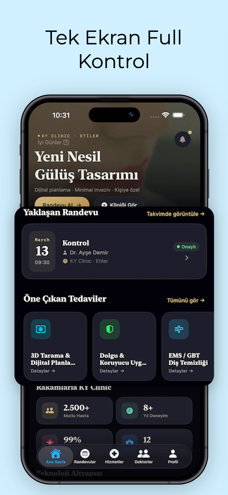
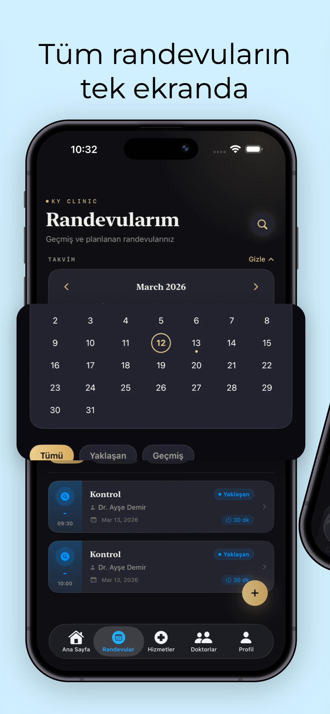
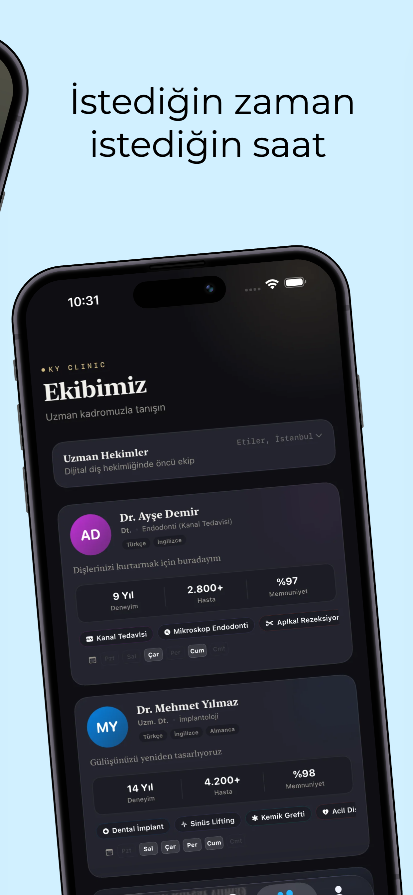
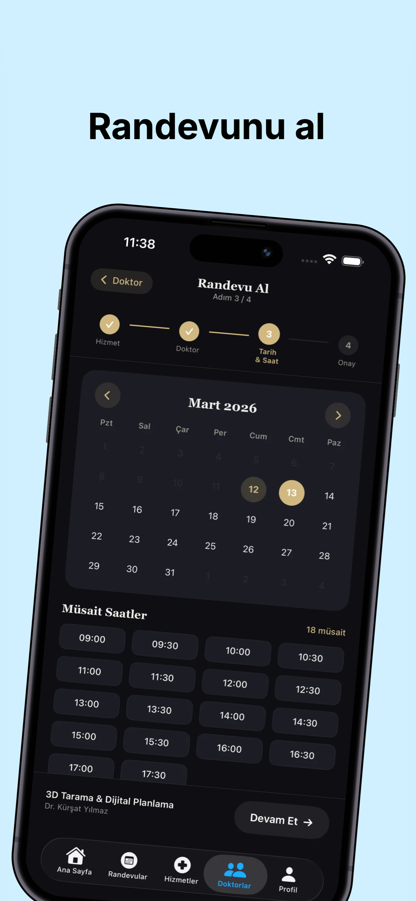
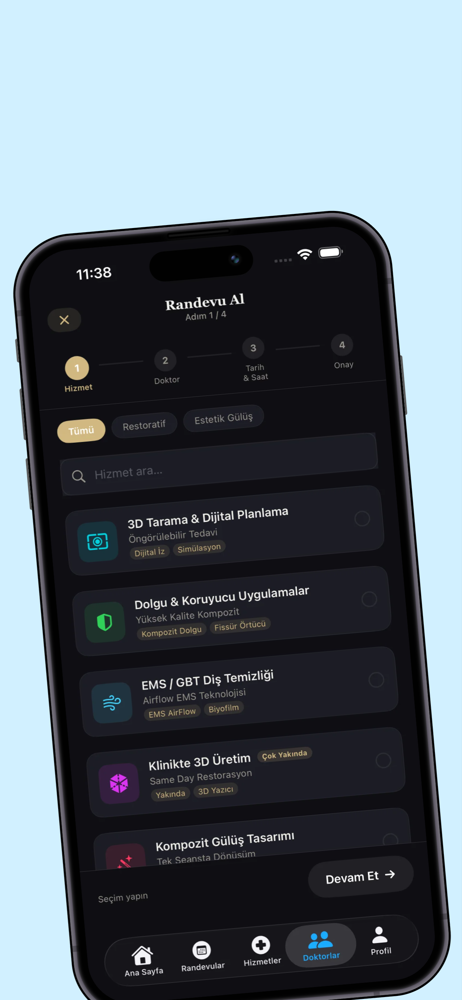

# 🦷 KY Clinic -- Dental Appointment App

Modern dental clinic management and appointment booking application
built with **SwiftUI**.

Patients can easily explore treatments, choose doctors, and book
appointments in seconds.

------------------------------------------------------------------------

## ✨ Features

-   📅 Easy appointment booking
-   👨‍⚕️ Doctor profiles and expertise
-   🦷 Treatment catalog
-   ⏰ Appointment management
-   📊 Digital dental experience
-   📱 Modern SwiftUI interface

------------------------------------------------------------------------

## 📱 Screenshots

### Home Screen

### Appointments

### Treatments

### Doctors

### Booking Appointment

### Select Service

------------------------------------------------------------------------

## 🏗 Tech Stack

-   SwiftUI
-   MVVM Architecture
-   Supabase / Backend API
-   Async/Await
-   Custom UI Components

------------------------------------------------------------------------

## 🧭 Appointment Flow

1.  Select **Treatment**
2.  Choose **Doctor**
3.  Pick **Date & Time**
4.  Confirm Appointment

------------------------------------------------------------------------

## 🔐 Privacy

Patient data is handled securely and follows **KVKK / GDPR principles**.

Sensitive information is protected and used only for appointment
management.

------------------------------------------------------------------------

## 👨‍💻 Developer

**Sinan Dinç**\
iOS Developer

-   Web3
-   Solidity
-   Blockchain
-   Swift / SwiftUI
-   Mobile Architecture
-   Backend Integrations
-   UI/UX focused development

------------------------------------------------------------------------

## 📄 License

MIT License
